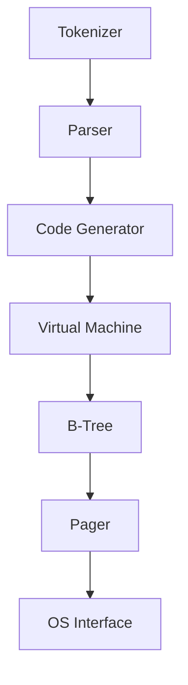

# データベースってどうやって動くの？

- どんなフォーマットでデータば保存されてる？（メモリ上で、そしてディスク上で）
- いつメモリからディスクにデータは移される？
- どうしてて０ブルに一つしかプライマリーキーはないの？
- トランザクションのロールバックはどうやって動くの？
- インデックスはどんなフォーマットで保存されてるの？
- いつフルテーブルスキャンは起こるの？
- どんなフォーマットでプレペアドステートメントは保存されてるの？

短く言えば、**データベースってどうやって動くの？**

それでは上記を理解するために、C言語でフルスクラッチのデータベースを作ってみましょう。

## アーキテクチャ

## 情報源

[Let's Build a Simple Database](https://cstack.github.io/db_tutorial/)
