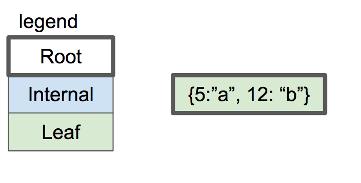
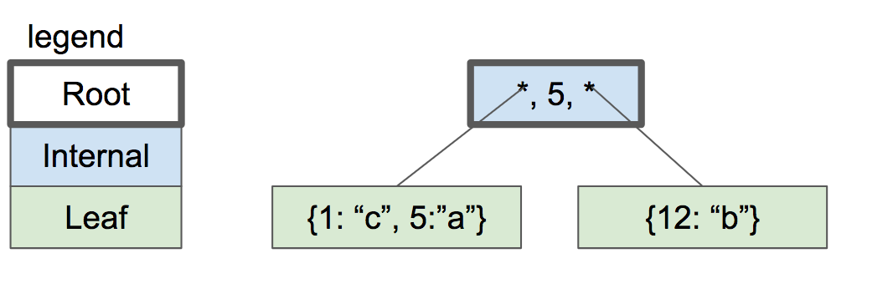

# B-木入門

**B-木** はテーブルとインデックスを表現するためにSQLiteが使っているデータ構造です。
つまり、SQLiteのとても中心的なアイデアです。
この記事では、このデータ構造を導入します。コードは書きません。

なぜB-木はデータベースにとって良いデータ構造なのでしょう。

- 探索がとても早い（探索する項目の数に対して対数でしか計算量が増えません）。
- すでに見つけた項目を挿入や削除するのも早い（バランス再調整に定数時間しかかかりません）。
- 項目の範囲を線形に探索するのも早い。（ハッシュマップとの違いです）。

B-木は二分木ではありません（binary tree。Bはおそらく発明者の名前から取られていますが、もしかしたら"balanced"の頭文字かもしれません）。
下記がB-木の例です。

二分木と違って、それぞれのノードは2以上の子ノードを持つことができます。
それぞれのノードはある非負整数m以下のノードを持つことができて、このmを木の「オーダー」と言います。
木をほぼバランス取れている状態にするために、全てのノードはm/2を切り上げた数以上の子ノードを持つべきです。

例外としては

- 歯ノードは子ノードを持ちません。
- 根ノードはm/2未満の子ノードしか持たなくても構いませんが、最低でも2個の子ノードを持たなくてはいけません。
- もし、根ノードが葉ノードであり、そして唯一のノードであるならば、やはり子ノードを持ちません。

上記のB木の図は、SQLiteがインデックスの保存に使っているものです。
SQLiteはテーブルの保存には **B+木** を使っています。

子ノードを持つノードのことを **内部ノード** と言いますが、通常B木では内部ノードも（上記の図にあるように）値を持ちますが、B+木では内部ノードは値を持たず、値を持つのは葉ノードだけです。
ここからわかるように、B+木では内部のーどと葉ノードは構造が違います。一方B木では、内部ノードと葉ノードは同じ構造を持ちます。
そういう意味ではB+木の方が複雑に思えるかもしれませんが、
一方、B+木では内部ノードは葉ノードよりも単純な構造にすることができます。少ないノードでたくさんのデータを収納できるのはB木です。

これをまとめると下の表のようになります。

||**B-Tree**|**B+Tree|
| ---- | ---- | ---- |
|発音|"Bee Tree"|"Bee Plus Tree"|
|何に使用されているか|インデックス|テーブル|
|内部ノードが値を持つか|はい|いいえ|
|子ノードの数|少ない|多い|
|内部ノード vs 葉ノード|同じ構造|違う構造|

インデックスを実装するまで、まずはB+木について説明します。

先ほども書いたように、B+木では内部ノードと葉ノードは異なる構造を持ちます。

|mオーダーのB+木で|内部ノード|葉ノード|
|保持する情報|キーと子ノードへのポインタ|キーと値|
|キーの数|m-1以下|可能な限りいくらでも|
|ポインタの数|キーの数+1|なし|
|キーの目的|ラウティング（道順極め）|値とのペア|
|値を保持するか？|いいえ|はい|

それでは要素を挿入した際、B+木がどのように伸びていくかを観察してみましょう。
話を簡単にするため、B+木のオーダーは3とします。

これはつまり

- 内部ノードの子ノードは3以下
- 内部ノードのキーは2以下
- 内部ノードの子ノードは2以上
- 内部ノードのキーは1以上

ということを意味します。

空のB+木は一つの根ノードを持っています。
この根ノードはキーも値も持たない葉ノードとしてスタートします:

もしキーと値の対を挿入すると、
葉ノードにキーの順序に並べられます。図では２つのキーと値の対が挿入されています。

内部ノードのキーの対の数の限界が2だったことを思い出しましょう。
もし、もう一つキーと値の対を挿入すると、
葉ノードを分裂させて、半分になったキーと値をそれぞれのノードに割り当てないといけません。
どちらのノードも新しい内部ノードの子ノードとなり、この新しい内部ノードが根ノードとなります。

内部ノードは1つのキー5を持ち、子ノードへのポインタを2つ持っています。
5以下のキーを探したければ、左の子ノードを探します。
5より大きいキーを探したければ、右の子ノードを探します。

ここでキー2を挿入してみましょう。
まず、キー2がもしあるとしたら属しているはずの葉ノードを調べます。
これによって左の葉ノードに辿り着きました。
そしてこのノードはもう一杯です。
そこで、このノードを分裂させて、親ノードに新しくポインタを登録します。

さらにキーを足しましょう。18と21にします。
さらに葉ノードを分裂させなくてはいけませんが、もう親ノードに新しいキーとポインタの対を足す場所がありません。

この問題の解決策は、根ノードを二つの内部ノードに分裂させ、新しい根ノードを作ることです。

通常の木のデータ構造と違い、葉ノードの側が成長して深くなっていくというより、根ノードの側が成長して深くなっていくことに注目してください。
木の深さがは根ノードが分裂した時だけ深くなっていきます。
全ての葉ノードは同じ深さをもち、ほぼ同じキーと値の対を持っています。
つまり、木はバランスが取れていて、素早く探索することが可能になっています。

削除の議論に関しては、挿入を実装してからにします。

このデータ構造を実装すると、全ての一つのノードは一つページに対応します。
根ノードはページ０に存在します。
子ノードへのポインタは、単純にその子ノードが含まれるページのページ数になります。

次はb+木を実装してみましょう。

